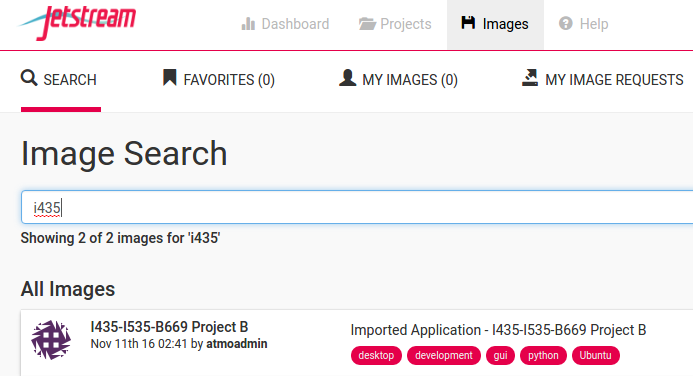
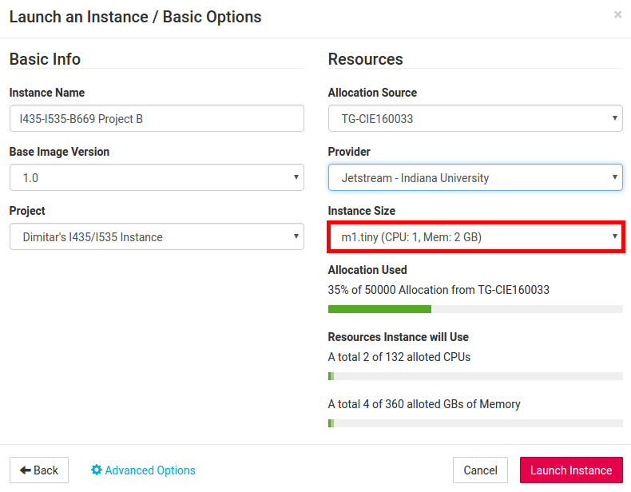

# I435 / I535 / B669 Project B: Analyzing Large Text Corpora

*This project description is available electronically at* **https://github.com/dimitargnikolov/book-project** *. If you would like to be able to follow the links, please access the document there.*

### Due: Monday, December 5 @ 11:59pm

## Table of Contents
1. [Introduction](#introduction)
2. [Prerequisites](#prerequisites)
3. [Setup](#setup)
  1. [Use of Jetstream](#use-of-jetstream)
  2. [Set Up Directories and Download Code](#set-up-directories-and-download-code)
4. [Case Study: The Characters Network in *Les Miserables*](#case-study-the-characters-network-for-les-miserables)
  1. [Adding a Book to MongoDB](#adding-a-book-to-mongodb)
  2. [Extracting the Characters from a Book](#extracting-the-characters-from-a-book)
  3. [Inferring Character Relationships](#inferring-character-relationships)
  4. [Analyzing and Visualizing the Network of Characters](#analyzing-and-visualizing-the-network-of-characters)
5. [Analyzing Other Texts](#analyzing-other-texts)
6. [Questions](#questions)

## Introduction

In this project you will create a database of books and learn how to analyze and visualize their text. In particular, you will learn how to techniques from natural language processing (NLP) to automatically discover the characters in a book, quantify the strength of relationship between them, find the important characters, identify groupings between them, and finally, create a beautiful visualization of your analyses. We will walk you through a case study of how to:

1. Download a book from [Project Gutenberg](https://www.gutenberg.org/) and import it into MongoDB.
2. Use [Python](https://www.python.org/) and its [Natural Language ToolKit (NLTK)](http://www.nltk.org/) library to extract a list of characters the book.
3. Learn how to process the text of the book to create a network of relationships between the characters.
4. Learn a couple common ways to analyze a network using network science tools.
5. Visualize the character relationships using the [Gephi](https://gephi.org/) graph visualization platform.

You will follow the case study, then if you choose, you will identify other content to analyze and share your insights.

The project will be graded as follows:  a student who follows instructions, does the entity recognition analysis for Les Miserables, and writes a reasonable report about his or her interpretations of the results will receive up to 93 points.  A student who selects new content to analyze and chooses the content in a way that reasoned interpretation is possible (the content is coherent with respect to characters), and further that the student demonstrates through their report that they carried out a reasoned intrepetation of the analysis results will receive a grade of up to 100%.    A student who does something exceptional in both the content that he or she is analyzing and how he or she is interpreting the analysis results will recieve up to 103 points. 

## Prerequisites

You need to be familiar with what we have been covering during the last several weeks of discussions. In particular, you need to:

1. Have your Jetstream account and allocation ready to use. If you don't, please refer to the [XSEDE Account Guide](https://iudatascience.soic.scholargrid.org/asset-v1:iudatascience+I535-I435-B669+FALL_2016+type@asset+block/Creating_XSEDE_Account__Jetstream_Tutorial_.pdf) and the [Using Jetstream](https://iudatascience.soic.scholargrid.org/asset-v1:iudatascience+I535-I435-B669+FALL_2016+type@asset+block/Using_Jetstream.pdf) tutorials.
2. Be able to upload files to your Jetstream instance. If you don't know how to do this, please refer to the [Setting Up SSH Keys](https://iudatascience.soic.scholargrid.org/asset-v1:iudatascience+I535-I435-B669+FALL_2016+type@asset+block/Generating_SSH_Key.pdf) and [Transfering files to Jetstream](https://iudatascience.soic.scholargrid.org/asset-v1:iudatascience+I535-I435-B669+FALL_2016+type@asset+block/Transfering_Files_to_Jetstream.pdf) tutorials.
3. Have the [Linux command cheat sheet](https://iudatascience.soic.scholargrid.org/asset-v1:iudatascience+I535-I435-B669+FALL_2016+type@asset+block/LinuxCommandsCheatSheet.pdf) we posted earlier in the class handy.

## Setup

### Use of Jetstream

We will continue to use Jetstream in this project. With a new allocation and the issues from a couple weeks ago largely resolved, this time you should have a smooth experience if you follow these instructions.

There is a new image for this project that comes pre-loaded with necessary software such as Python and mongodb. Head on over to [use.jetstream-cloud.org](https://use.jetstream-cloud.org) and create a new instance of the *I435/I535/B669 Project B* image (created either by user *atmoadmin* or *dnikolov*). You can find the image by searching for *I435*:



When you create the new instance, please use the **Jetstream - TACC** provider and the **tiny** instance size to avoid any hanging issues or needlessly spending our allocation:



### Set Up Directories and Download Code

Once your instance is active, go ahead and access it via the *Web Shell* or an *ssh* client of your choice.

You need to set up a directory for the project and download the code for it using *Git*, a popular system for version control and project file management.

```
$ mkdir ~/Projects
$ cd ~/Projects
$ git clone https://github.com/dimitargnikolov/book-project.git
$ cd book-project
```

In addition, you need to copy the sample start-up script provided with the project code to your home directory as follows:

```
$ cp sample.bashrc ~/.bashrc
$ source .bashrc
```

These commands create a start-up script called `.bashrc` in your home directory. `.bashrc` is a special file that Linux looks for when it starts up, and thus, it will be executed every time your instance starts. In this case, since you already have your instance started, we executed the file manually with the `source` command. You can take a look at the contents if you like:

```
$ cat ~/.bashrc
```

All the script does is it creates two environmental variables -- one that allows the code to easily find your project directory, and the other, that makes sure your instance knows where to find the correct version of Python.

With this, the setup of your environment is done. You don't need to execute any of the previous steps again. Unless otherwise noted, all commands in this document should be executed on your Jetstream instance, inside the `~/Projects/book-project` directory.

## Case Study: The Characters Network for *Les Miserables*

In this case study, we will walk you through all the steps needed to extract and visualize the character relationships in the book *Les Miserables*.

### Adding a Book to MongoDB

We'll start with a single book, *Les Miserables*, that you can download from [Project Gutenberg](https://www.gutenberg.org/). From the main page, you can go to *Book Search Page*, then *Popular*, and click on the book title towards the top of the list (third position as of Oct 3, 2016). From the download page, choose the **Plain Text UTF-8** format and download it to your `~/Projects/book-projectA/data` directory as `les-mis.txt`. You can do all this from the command line as follows:

```
$ wget https://www.gutenberg.org/files/135/135-0.txt -O ~/Projects/book-project/data/les-mis.txt
```

Next, you need to insert the contents of the book in the `books` collection in MongoDB. As mentioned in the introduction, to do this, you will use Python and its PyMongo extension instead of the MongoDB shell, because Python provides the environment and libraries to complete not only this, but other necessary tasks such as reading files, running syntactic analysis and gathering statistics about the text.

```
$ cd ~/Projects/book-project
$ python
```
```python
>>> import pymongo
>>> from pymongo import MongoClient
>>> mongodb = MongoClient()
>>> db = mongodb.projectA
>>> with open('data/les-mis.txt', 'r') as f: text = f.read()
>>> db.books.insert({'author': 'Victor Hugo', 'title': 'Les Miserables', 'text': text})
```

You will notice that as soon as you type `python` the shell symbol changes from the familiar `$` to `>>>`. This means you are in the Python shell (as opposed to the system shell). You can exit the Python shell at any time by pressing `Ctrl-D`.

The first four lines from the Python shell above set up access to MongoDB and the `projectA` database through the `db` variable. From there on, you can use `db` to execute MongoDB statements in an almost identical way to what you're used to from the MongoDB shell shown to you during discussion.

The fifth line, reads the contents of the book that you downloaded and stores it in the variable `text`. In Python, you can see the contents of a variable at any time by typing its name, so if you type

```python
>>> text
```

you will see the contents of the book scroll through your screen. This is too much text to be useful, so you can type the following instead, to only look at the first 100 characters of the text:

```python
>>> text[:100]
```

You should get in the habit of looking at the contents of variables in this way, as it will prove useful when debugging any errors.

Finally, the last line should be familiar, since it's identical to an `insert` command you would issue in the MongoDB shell. It puts the book in the `books` collection in MongoDB as an object consisting of an *author*, *title* and the *text* of the book.

You now have the text of the book and in MongoDB for later use and analysis.

### Extracting the Characters from a Book

Coming up with a list of all characters in a book would be a daunting task even for a book you are familiar with. Fortunately, we can automate this process using a technique called [named-entity recognition](). This technique uses knowledge about a language's grammar combined with statistical properties of text to assign entities in the text to pre-defined groups such as persons, organizations, locations and so on. The current state-of-the-art in named-entity recognition is not perfect, but it's pretty good and you will use it to extract a list of characters in *Les Miserables*.

Named-entity recognition is a common task in natural language processing applications and algorithms for it have been implemented in many languages. We will use Python's `nltk` library to extract a list of person-entities from the book. However, even using these libraries can be a little tricky and beyong the scope of this project, so we have written some code that makes working with book text simple. The code is located in the `lib.py` file that came with th e project. You do not need to understand how the code in this file works, only how to use it. For example, loading the book and extracting the characters is simple.

First, you need to make sure you have access to MongoDB so you can load the contents of the book:

```python
>>> import pymongo
>>> from pymongo import MongoClient
>>> mongodb = MongoClient()
>>> db = mongodb.projectA
>>> mongo_results = db.books.find({'title': 'Les Miserables'})
```

In the last line, you are using a `find` MongoDB command to retrieve all books in the database with the title *Les Miserables*. Of course, only one book will match the search query, but keep this in mind in the second half of the project where you will be using your own data. 

You can load the text from the search results and run the character extraction algorithm in three lines. The code might take a few seconds to run, so be patient:

```python
>>> from lib import *
>>> tagged_texts = tag_texts(mongo_results)
>>> chars = find_people(tagged_texts)
```

If you now view the contents of the `chars` variable, you will see something like this:

The results are not perfect -- there are some characters that shouldn't be there like `Which`, `Project Gutenberg`, `Project Gutenberg-tm` and so on. This is in part due to the fact that the text we are working with is not entirely clean and contains a header and footer that is not actually part of the book. In part, this is due to the entity-extraction algorithm not being perfect and getting fooled by non-traditional capitalization in the book.

This is another illustration of the need for setting up a data pipeline to clean your data before it is analyzed. In this case, we will clean the data manually, since setting up a data pipeline is beyond the scope of this project. 

You can quickly clean up the list of characters as follows:

```python
>>> chars.remove('A')
...
```

Continue using the `remove` function as above for other strings that were extracted as characters but should not have been. You don't need to have a perfect list of characters to continue to the next step, but do your best.

### Inferring Character Relationships

Now that you have a list of characters you are interested in analyzing, we want to infer how closely related they are to each other. What we mean by that is that characters who appear in the same scenes or talk to each other often, should be considered more closely related than characters who don't. We can represent the character relationships as a network where each node is a character, and each edge denotes the strength of relatedness between two nodes. Using a network representation like this is very powerful since it will later allow us to leverage a lot of knowledge about [network analysis]() and apply it directly to our problem in this project.

How do we determine how strong the edges between characters should be? We will derive this from the text of the book itself assuming that characters that appear close to each other on a page are also more closely related. Programatically, this involves scanning the text of the book using a sliding window of `N` characters and marking increasing the strength of relatedness between any characters who happen to be in the window at the same time. For example, consider this paragraph:

> "**Fantine, Dahlia** *and* **Zéphine** *have been teasing us for nearly
> a year to give them* a surprise. We have promised them solemnly that we
> would. They are forever talking about it to us, to me in particular,
> just as the old women in Naples cry to Saint Januarius, 'Faccia
> gialluta, fa o miracolo, Yellow face, perform thy miracle,' so our
> beauties say to me incessantly, 'Tholomyès, when will you bring forth
> your surprise?' At the same time our parents keep writing to us.
> Pressure on both sides. The moment has arrived, it seems to me; let us
> discuss the question."

Here, we are using a window of 15 characters (the italicized portion of text). We start at the beginning of the paragraph and we already see that *Fantine*, *Dahlia* and *Zephine* appear close together, so we will update the network representation to strengthen the edge between the *Fantine* and *Dahlia*, *Fantine* and *Zephine*, and *Dahlia* and *Zephine* nodes.

We've done all of this for you in `lib.py`, so you can simply use the following function to create the network representation:

```python
network = create_network(book, chars, N=15) 
```

Note that the number of characters in the sliding window can be specified. In this case, it's `N=15`.

We are going to save the network as a file, so we can use network analysis and visualization tools on it:

```python
import networkx as nx
nx.write_gml(network, os.path.join('networks', 'les-mis.gml'))
```

The details of the command above are not important. Suffice it to say, an `les-mis.gml` file will appear in the `networks` folder of your project.

If you look at the file that was generated, you will see something that looks like this:
```
graph [
  node [
    id 0
    label "Valjean"
  ]
  node [
    id 1
    label "Fantine"
  ]
  ...
  edge [
    source 0
    target 19
    weight 1
  ]
  edge [
    source 1
    target 16
    weight 1
  ]
  ...
]
```

### Analyzing and Visualizing the Network of Characters

To analyze this network, you will use the [Gephi graph analysis and visualization platform](https://gephi.org/). We will do a tutorial on Gephi during discussion, and will provide a recording of it as well. At the end of the tutorial, you will produce a visualization of the characters in *Les Miserables*. Your visualization should end up looking similar to this:


## Analyzing Other Texts

The case study gives you the tools to analyze any collection of texts and extract and visualize a network of the people mentioned. The steps are the same:

1. Insert your text(s) in MongoDB.
2. Write a `find` query to retrieve all the texts from MongoDB.
3. Pass the results of the query to the `load_text` and `find_people` functions to find any people mentioned in the text.
4. Clean up the list of people using the `remove` command.
5. Use the `create_network` function to create a network representation of the relationships between people in the texts.
6. Use Gephi to find important characters and groups of similar characters in the network.

For this part of the project, repeat this analysis for a book or a collection of texts of your choosing. You can take another book from Project Gutenberg, a set of books who share characters, or a set of news articles or blog entries. The source and format of the text is up to you, as long as you can import it into MongoDB.

To make your life easier, we'll provide you with a function that can import a collection of text files into MongoDB. Say, you've collected your texts as plain-text files and you've uploaded them to your Jetstream instance in `~/Projects/i435-projectA/data`. Then, you can important all these files in the Python shell as follows:

```python
>>> from lib import *
>>> insert_txt_to_mongodb('data/')
```

The script will insert any `.txt` file in the `data` directory in MongoDB with attribute `title` set as the name of the file, and attribute `text` set to the text inside the file.

Using this script, you are not limited to a single book or document.

## Report and Deliverable

For this project you will submit a portfolio that contains a final report and files that demonstrate your work.  You will submit to the Canvas assignment for the project.

1. The report (DOC, DOCX, PDF) that you write must contain: 
  -- Lists all sources of help that you consulted, including other students. You need not mention AIs nor class resources. 
  -- Answers the questions in 3-5 below depending on which parts of the project you decided to do. 

2. For those who carried out Les Miserables analysis, your report will answer 2a-2b, and you will submit file 2c.  

2a. Is a window of size 15 a good window size for the characters that you think are related?  
2b. What are the strengths and weaknesses of a larger window size?  Give an example of a relationship that was missed because of a window size of N=15
2c.  Include a copy of the network graph (or portion of it) that you generated for the characters in Les Miserables from Gephi (PDF)

3.  For those who carried out the Les Miserables analysis plus analysis over their own content, your report will answer 2a-2b, submit file 2c, plus answer 3a and submit 3b and 3c:

3a.  When you analyzed texts of your own choosing that you're familiar with or interested in, did you glean any insights from this type of analysis that would be harder to glean from a simple readthrough?
3b.  Include a copy of the graph (or portion of it) that you generated for the characters in content you chose (PDF)
3c.  An archive containing the text(s) you chose to analyze (ZIP).

4. For those who carried out the Les Miserables analysis plus analysis over their own content, plus carried out analysis beyond, your report will include all of the above plus answer 4a and include 4b and 4c:

4a. When you extract the characters, create the network representation and apply the network analysis algorithms, there is some fine-tuning of the algorithms that needs to happen. Try exhaustively cleaning your list of characters, adjusting the parameter values for the length of the text window, or the number of communities. How do the results differ? Did you need to do a lot of fine-tuning to produce a visualization that was useful and easy to understand? What ways of automating this fine-tuning can you think of?
4b.  Include a copy of the graph (or portion of it) that you generated for the characters in content you chose that went through the cleaning suggested in 4a (PDF)
4c.  An archive containing the text(s) you chose to analyze in the second part of the project (ZIP)

