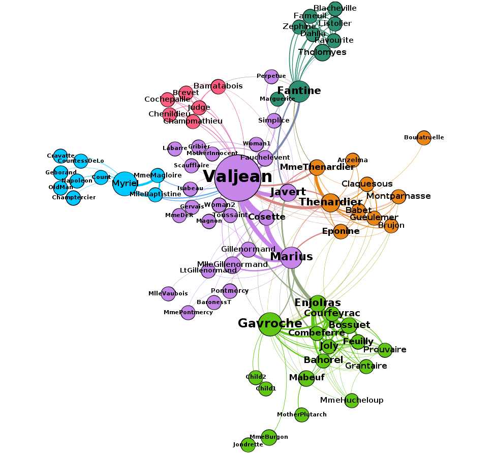

# I435 / I535 / B669 Project B: Using Text and Network Analysis Tools to Analyze Large Text Corpora

## Table of Contents
1. [Introduction](#introduction)
2. [Prerequisites](#prerequisites)
3. [Setup](#setup)
  1. [Install Python](#install-python)
  2. [Install PyMongo](#install-pymongo)
  3. [Additional Setup Tasks](#additional-setup-tasks)
4. [Case Study: The Characters Network in *Les Miserables*](#case-study-the-characters-network-for-les-mis)
  1. [Adding a Book to MongoDB](#adding-a-book-to-mongodb)
  2. [Extracting the Characters from a Book](#extracting-the-characters-from-a-book)
  3. [Inferring Character Relationships](#inferring-character-relationships)
  4. [Analyzing the Network of Characters](#analyzing-the-network-of-characters)
  5. [Visualizing the Network of Characters](#visualizing-the-network-of-characters)
5. [Analyzing Other Texts](#analyzing-other-texts)
6. [Questions](#questions)

## Introduction

In this project you will create a database of books and learn how to analyze and visualize their text. In particular, you will learn how to techniques from natural language processing (NLP) to automatically discover the characters in a book, quantify the strength of relationship between them, find the important characters, identify groupings between them, and finally, create a beatiful visualizatino of your analyses. We will walk you through a case study of how to:

1. Download a book from [Project Gutenberg](https://www.gutenberg.org/) and import it into MongoDB.
2. Use [Python](https://www.python.org/) and its [Natural Language ToolKit (NLTK)](http://www.nltk.org/) library to extract a list of characters the book.
3. Learn how to process the text of the book to create a network of relationships between the characters.
4. Learn a couple common ways to analyze a network using network science tools.
5. Visualize the character relationships using the [Gephi](https://gephi.org/) graph visualization platform.

Following the case study, you will carry out the same analyses on a book, or a set of texts you are familiar with, and share your insights.

## Prerequisites

You need to be familiar with what we have been covering during the last several weeks of discussions. In particular, you need to:

1. Have your Jetstream account and allocation ready to use. If you don't, please refer to the [XSEDE Account Guide](https://iudatascience.soic.scholargrid.org/asset-v1:iudatascience+I535-I435-B669+FALL_2016+type@asset+block/Creating_XSEDE_Account__Jetstream_Tutorial_.pdf) and the [Using Jetstream](https://iudatascience.soic.scholargrid.org/asset-v1:iudatascience+I535-I435-B669+FALL_2016+type@asset+block/Using_Jetstream.pdf) tutorials.

2. Be able to upload files to your Jetstream instance. If you don't know how to do this, please refer to the [Setting Up SSH Keys](https://iudatascience.soic.scholargrid.org/asset-v1:iudatascience+I535-I435-B669+FALL_2016+type@asset+block/Generating_SSH_Key.pdf) and [Transfering files to Jetstream](https://iudatascience.soic.scholargrid.org/asset-v1:iudatascience+I535-I435-B669+FALL_2016+type@asset+block/Transfering_Files_to_Jetstream.pdf) tutorials.

## Setup

### Project Files

You need to set up a directory for the project and download the project files using Git, a popular system for version control and project file management.

```
$ mkdir ~/Projects
$ cd ~/Projects
$ git clone https://github.iu.edu/dnikolov/i435-projectA
$ cd i435-projectA
```

### Additional Setup Tasks

```
$ mongo
> use projectA
> db.createCollection('books')
```

## Case Study: The Characters Network for *Les Miserables*

In this case study, you will be walked through all the steps needed to extract and visualize the character relationships in the book *Les Miserables*. There is a [video tutorial]() to go with this section where you can see the steps described below carried out on the screen. 

### Adding a Book to MongoDB

We'll start with a single book, *Les Miserables*, that you can download from [Project Gutenberg](https://www.gutenberg.org/). From the main page, you can go to *Book Search Page*, then *Popular*, and click on the book title towards the top of the list (third position as of Oct 3, 2016). From the download page, choose the **Plain Text UTF-8** format and download it to your `~/Projects/i435-projectA/data` directory as `lesmis.txt`. You can do all this from the command line as follows: 
```
$ wget https://www.gutenberg.org/files/135/135-0.txt -O ~/Projects/i435-projectA/data/lesmis.txt
```

Next, you need to insert the contents of the book in the `books` collection in MongoDB. As mentioned in the introduction, to do this, you will use Python and its PyMongo extension instead of the MongoDB shell, because Python provides the environment and libraries to complete not only this, but other necessary tasks such as reading files, running syntactic analysis and gathering statistics about the text.

```
$ cd ~/Projects/i435-projectA
$ python
>>> import pymongo
>>> from pymongo import MongoClient
>>> mongodb = MongoClient()
>>> db = mongodb.projectA
>>> with open('data/lesmis.txt', 'r') as f: text = f.read()
>>> db.books.insert({'author': 'Victor Hugo', 'title': 'Les Miserables', 'text': text})
```

The first four lines above set up access to MongoDB and the `projectA` database through the `db` variable. From there on, you can use `db` to execute MongoDB statements in an almost identical way to what you're used to from the MongoDB shell shown to you during discussion.

The fifth line, reads the contents of the book that you downloaded and stores it in the variable `text`. In Python, you can see the contents of a variable at any time by typing its name, so if you type

```
>>> text
```

you will see the contents of the book scroll through your screen.

Finally, the last line should be familiar, since it's identical to an `insert` command you would issue in the MongoDB shell. It puts the book in the `books` collection in MongoDB as an object consisting of an *author*, *title* and the *text* of the book.

You now have the text of the book and in MongoDB for later use and analysis.

### Extracting the Characters from a Book

Coming up with a list of all characters in a book would be a daunting task even for a book you are familiar with. Fortunately, we can automate this process using a technique called [named-entity recognition](). This technique uses knowledge about a language's grammar combined with statistical properties of text to assign entities in the text to pre-defined groups such as persons, organizations, locations and so on. The current state-of-the-art in named-entity recognition is not perfect, but it's pretty good and you will use it to extract a list of characters in *Les Miserables*.

Named-entity recognition is a common task in natural language processing applications and algorithms for it have been implemented in many languages. We will use Python's `nltk` library to extract a list of person-entities from the book. However, even using these libraries can be a little tricky and beyong the scope of this project, so we have written some code that makes working with book text simple. The code is located in the `lib.py` file that came with th e project. You do not need to understand how the code in this file works, only how to use it. For example, loading the book and extracting the characters is simple.

First, you need to make sure you have access to MongoDB so you can load the contents of the book:

```
>>> import pymongo
>>> from pymongo import MongoClient
>>> mongodb = MongoClient()
>>> db = mongodb.projectA
>>> mongo_results = db.books.find({'title': 'Les Miserables'})
```

In the last line, you are using a `find` MongoDB command to retrieve all books in the database with the title *Les Miserables*. Of course, only one book will match the search query, but keep this in mind in the second half of the project where you will be using your own data. 

You can load the text from the search results and run the character extraction algorithm in three lines. The code might take a few seconds to run, so be patient:

```
>>> from lib import *
>>> book = load_text(mongo_results)
>>> chars = find_people(book)
```

If you now view the contents of the `chars` variable, you will see something like this:

The results are not perfect -- there are some characters that shouldn't be there like `Which`, `Project Gutenberg`, `Project Gutenberg-tm` and so on. This is in part due to the fact that the text we are working with is not entirely clean and contains a header and footer that is not actually part of the book. In part, this is due to the entity-extraction algorithm not being perfect and getting fooled by non-traditional capitalization in the book.

This is another illustration of the need for setting up a data pipeline to clean your data before it is analyzed. In this case, we will clean the data manually, since setting up a data pipeline is beyond the scope of this project. 

You can quickly clean up the list of characters as follows:

```
>>> chars.remove('Which')
>>> chars.remove('Project Gutenberg')
>>> chars.remove('Project Gutenberg-tm')
...
```

Continue using the `remove` function as above for other strings that were extracted as characters but should not have been. You don't need to have a perfect list of characters to continue to the next step, but do your best.

### Inferring Character Relationships

Now that you have a list of characters you are interested in analyzing, we want to infer how closely related they are to each other. What we mean by that is that characters who appear in the same scenes or talk to each other often, should be considered more closely related than characters who don't. We can represent the character relationships as a network where each node is a character, and each edge denotes the strength of relatedness between two nodes. Using a network representation like this is very powerful since it will later allow us to leverage a lot of knowledge about [network analysis]() and apply it directly to our problem in this project.

How do we determine how strong the edges between characters should be? We will derive this from the text of the book itself assuming that characters that appear close to each other on a page are also more closely related. Programatically, this involves scanning the text of the book using a sliding window of `N` characters and marking increasing the strength of relatedness between any characters who happen to be in the window at the same time. For example, consider this paragraph:

> "**Fantine, Dahlia** *and* **Zéphine** *have been teasing us for nearly
> a year to give them* a surprise. We have promised them solemnly that we
> would. They are forever talking about it to us, to me in particular,
> just as the old women in Naples cry to Saint Januarius, 'Faccia
> gialluta, fa o miracolo, Yellow face, perform thy miracle,' so our
> beauties say to me incessantly, 'Tholomyès, when will you bring forth
> your surprise?' At the same time our parents keep writing to us.
> Pressure on both sides. The moment has arrived, it seems to me; let us
> discuss the question."

Here, we are using a window of 15 characters (the italicized portion of text). We start at the beginning of the paragraph and we already see that *Fantine*, *Dahlia* and *Zephine* appear close together, so we will update the network representation to strengthen the edge between the *Fantine* and *Dahlia*, *Fantine* and *Zephine*, and *Dahlia* and *Zephine* nodes.

We've done all of this for you in `lib.py`, so you can simply use the following function to create the network representation:

```
network = create_network(book, chars, N=15) 
```

Note that the number of characters in the sliding window can be specified. In this case, it's `N=15`.

We are going to save the network as a file, so we can use network analysis and visualization tools on it:

```
import networkx as nx
nx.write_gml(network, os.path.join('networks', 'lesmis.gml'))
```

The details of the command above are not important. Suffice it to say, an `lesmis.gml` file will appear in the `networks` folder of your project.

If you look at the file that was generated, you will see something that looks like this:
```
graph [
  node [
    id 0
    label "Valjean"
  ]
  node [
    id 1
    label "Fantine"
  ]
  ...
  edge [
    source 0
    target 19
    weight 1
  ]
  edge [
    source 1
    target 16
    weight 1
  ]
  ...
]
```

### Analyzing and Visualizing the Network of Characters

To analyze this network, you will use the [Gephi graph analysis and visualization platform](). We have created a video tutorial for this step that you can find [here](). At the end of the tutorial, you will produce a visualization of the characters in *Les Miserables*. Your visualization should end up looking similar to this:




## Analyzing Other Texts

The case study gives you the tools to analyze any collection of texts and extract and visualize a network of the people mentioned. The steps are the same:

1. Insert your text(s) in MongoDB.
2. Write a `find` query to retrieve all the texts from MongoDB.
3. Pass the results of the query to the `load_text` and `find_people` functions to find any people mentioned in the text.
4. Clean up the list of people using the `remove` command.
5. Use the `create_network` function to create a network representation of the relationships between people in the texts.
6. Use Gephi to find important characters and groups of similar characters in the network.

For this part of the project, repeat this analysis for a book or a collection of texts of your choosing. You can take another book from Project Gutenberg, a set of books who share characters, or a set of news articles or blog entries. The source and format of the text is up to you, as long as you can import it into MongoDB.

To make your life easier, we'll provide you with a function that can import a collection of text files into MongoDB. Say, you've collected your texts as plain-text files and you've uploaded them to your Jetstream instance in `~/Projects/i435-projectA/data`. Then, you can important all these files in Python using these commands:

```
$ python
>>> from lib import *
>>> insert_txt_to_mongodb('data/')
```

The script will insert any `.txt` file in the `data` directory in MongoDB with attribute `title` set as the name of the file, and attribute `text` set to the text inside the file.

Using this script, you are not limited to a single book or document.

## Questions

1. When you analyzed texts of your own choosing that you're familiar with or interested in, did you glean any insights from this type of analysis that would be harder to glean from a simple readthrough?
2. When you extract the characters, create the network representation and apply the network analysis algorithms, there is some fine-tuning of the algorithms that needs to happen. Try exhaustively cleaning your list of characters, adjusting the parameter values for the length of the text window, or the number of communities. How do the results differ? Did you need to do a lot of fine-tuning to produce a visualization that was useful and easy to understand? What ways of automating this fine-tuning can you think of?

## Deliverables

In the Canvas assignment for the project, submit three files:

1. The *Les Miserables* network you created in Gephi (PDF).
2. The network you created in Gephi based on text of your choosing (PDF).
3. A document with answers to the questions posed above (TXT or DOC/DOCX). 
